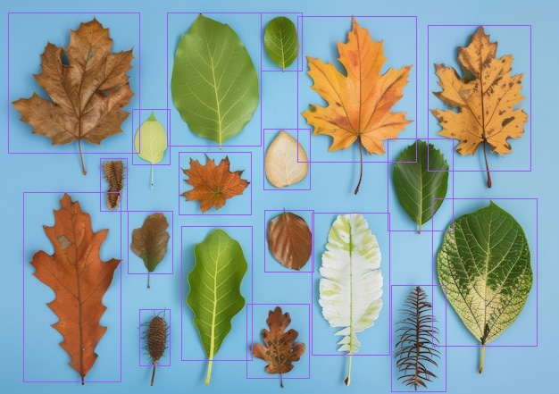
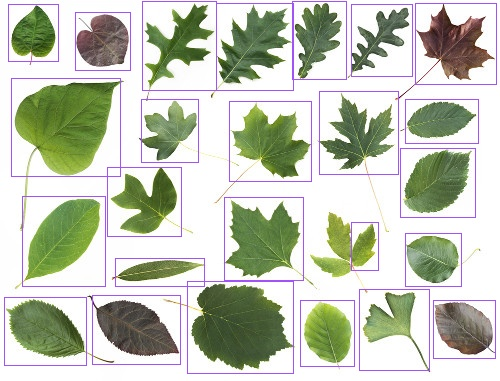
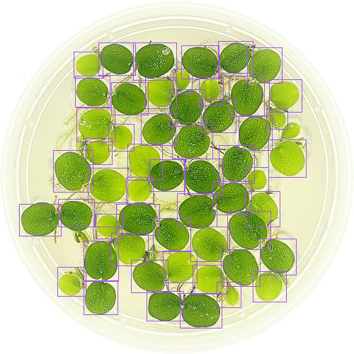
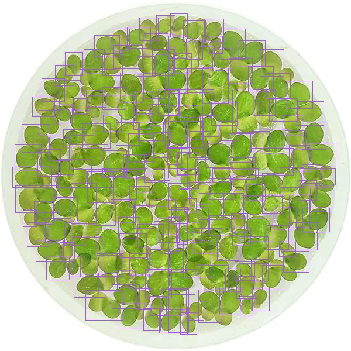
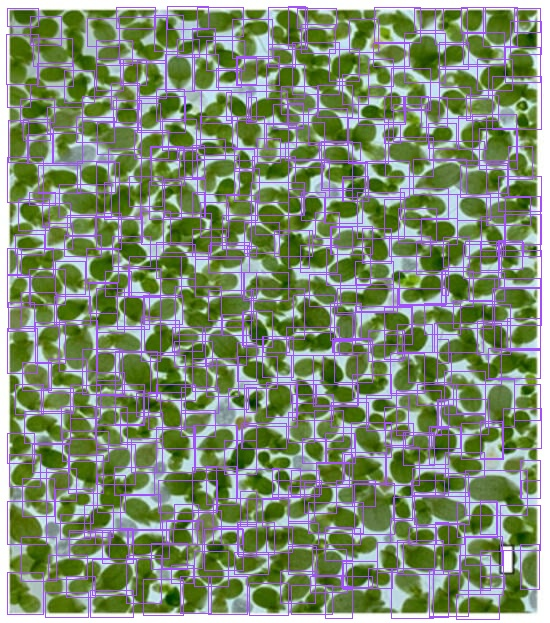

# Desafio IA - Detecção de objetos usando YOLO

- [Detalhes](#detalhes)
- [Código e Reprodução](#código-e-reprodução)
- [Resultados](#resultados)

## Detalhes
Utilizei um modelo treinado na plataforma [Roboflow](https://universe.roboflow.com/) com um dataset que é a junção de vários datasets de projetos de detecção de folhas com YOLO.

O modelo final, treinado a partir do modelo YOLO-NAS, pode ser encontrado [aqui](https://universe.roboflow.com/jc-98d3n/plant-leaf-detection-att1p/dataset/2).

Links das ferramentas principais que utilizei:
- [YOLOv8 GitHub](https://github.com/ultralytics/ultralytics)
- [Ultralytics docs](https://docs.ultralytics.com/)
- Datasets e Modelos: [Roboflow](https://universe.roboflow.com/)
- [Supervision docs](https://supervision.roboflow.com/latest/)
- [SAHI](https://github.com/obss/sahi)

Os meus rascunhos e testes de códigos estão todos no Jupyter Notebook [rascunhos_desafio.ipynb](https://github.com/juliokscesar/desafioia-yolo/blob/main/rascunhos_desafio.ipynb).


## Código e reprodução
Para utilizar o código de detecção, é necessário clonar o repositório e instalar todos os pacotes que o código utiliza (recomendo ser em um ambiente virtual):
```
git clone https://github.com/juliokscesar/desafioia-yolo
cd desafioia-yolo
python -m venv .venv

source .venv/bin/activate # Linux
.venv\Scripts\activate # Windows

pip install -r requirements.txt
```

**IMPORTANTE**: É necessário ter uma chave de API da plataforma Roboflow. É só [criar](https://app.roboflow.com/) uma conta na plataforma e seguir para Configurações da Conta > Roboflow API e copiar a "Private API Key". Então é só setar a chave como uma variável de ambiente com nome `ROBOFLOW_API_KEY` antes de executar a ferramenta:
- Linux (Shell): `export ROBOFLOW_API_KEY="chave"`
- Windows (PowerShell): `$Env:ROBOFLOW_API_KEY = "chave"`

E então é só executar `python desafio.py [args]`, que funcionará como uma ferramenta no terminal. Executando `python desafio.py -h` explica as opções para os argumentos:
```
usage: desafio.py [-h] [-s] [--confidence CONFIDENCE] [--overlap OVERLAP] [--slicew SLICEW] [--sliceh SLICEH] [--sliceoverlapw SLICEOVERLAPW]
                  [--sliceoverlaph SLICEOVERLAPH]
                  image

Desafio de deteccao de objetos com YOLO

positional arguments:
  image                 Imagem para fazer a detecção

options:
  -h, --help            show this help message and exit
  -s, --save            Salvar a imagem com detecções ao invés de plotar
  --confidence CONFIDENCE, -c CONFIDENCE
                        Padrão: 50. Valor 'confidence' para fazer a inferencia (entre 0 e 100). Objetos detectados com valor abaixo desse serão
                        descartados.
  --overlap OVERLAP, -o OVERLAP
                        Padrão: 50. Valor máximo de 'overlap' até juntar duas detecções (entre 0 e 100)
  --slicew SLICEW       Padrão: 640. Largura de cada recorte (slice) da imagem para fazer inferências
  --sliceh SLICEH       Padrão: 640. Altura de cada recorte (slice) da imagem para fazer inferência
  --sliceoverlapw SLICEOVERLAPW
                        Padrão: 0.1. Valor de largura de 'overlap' para cada divisão (slice) (entre 0 e 1)
  --sliceoverlaph SLICEOVERLAPH
                        Padrão: 0.1. Valor de altura de 'overlap' para cada divisão (slice) (entre 0 e 1)
```

As imagens do desafio estão no diretório `imgs/`, então para usar a ferramenta e detectar e contar as folhas da imagem 0.jpg, por exemplo:
```
python desafio.py imgs/0.jpg
```

A ferramenta então mostra quantos objetos detectou na imagem e abre um plot (do matplotlib) mostrando a imagem com as caixas delimitando os objetos. 

Caso queira salvar a imagem resultante localmente, é só passar a opção `--save`:
```
python desafio.py imgs/0.jpg --save
```

A imagem será salva no diretório `exp/` com o nome `exp0.jpg` (no caso de `imgs/0.jpg`).

### Descrição do código
O código basicamente utiliza a API da plataforma Roboflow pelos pacotes `roboflow` e `supervision` para poder utilizar o modelo disponível nela e fazer as inferências, já que não foi possível treinar o modelo na minha própria máquina. Então tem duas funções principais: 
- `slice_infer_image`: utiliza a framework SAHI embutida na biblioteca `supervision` para fazer inferências em recortes da imagem, melhorando a detecção de objetos pequenos.

- `generate_annotated_image`: só pega os resultados das detecções da função `slice_infer_image` e gera uma nova imagem com as anotações das caixas que delimitam os objetos detectados.


## Resultados

Em cada imagem, o 'melhor resultado' foi obtido depois de vários testes com diferentes valores de parâmetros (*confidence, overlap, slice width, slice height, slice overlap width, slice overlap height*).

### Primeira imagem
**Melhor resultado**: 19 (de 19)
**Parâmetros**: Conf=50, overlap=50, slice_wh=(640, 640), slice_overlap_wh=(0.1, 0.1)
Imagem com anotações:


### Segunda imagem
**Melhor resultado**: 25 (de 25) (mas uma delas detecta apenas na metade)
**Parâmetros**: Conf=50, overlap=10, slice_wh=(640, 640), slice_overlap_wh=(0.1, 0.1)


### Terceira imagem
**Melhor resultado**: 55 (de 55) **mas tem uma delas que não está detectando na lateral direita. Então tem uma repetida
**Parâmetros**: Conf=50, overlap=50, slice_wh=(640, 320), slice_overlap_wh=(0.1, 0.1)


### Quarta imagem
**Melhor resultado**: 201 (de ??) **Como não sei a contagem real, julguei o "melhor" resultado pelo que parecia ter menos detecções repetidas e duplas (duas folhas em uma caixa só) e que não fugiam muito de um valor comum quando testava com outros parâmetros.
**Parâmetros**: Conf=50, overlap=50, slice_wh=(320, 320), slice_overlap_wh=(0.1, 0.1)


### Quinta imagem
**Melhor resultado:** 434 (de ??) **Julguei o melhor resultado da mesma forma que a anterior
**Parâmetros**: Conf=50, overlap=50, slice_wh=(160, 160), slice_overlap_wh=(0.4, 0.4)

